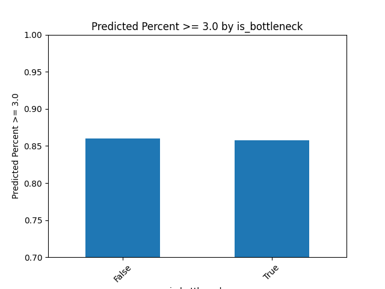
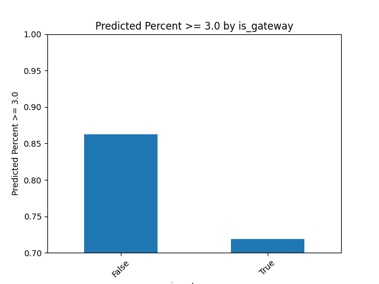
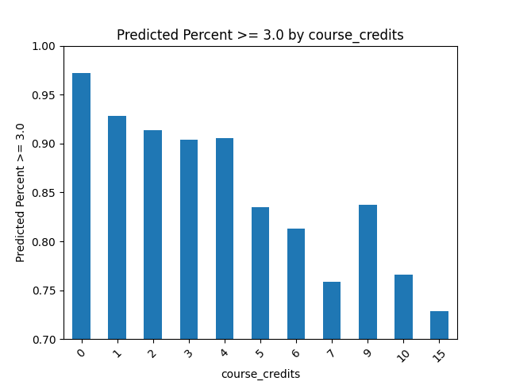
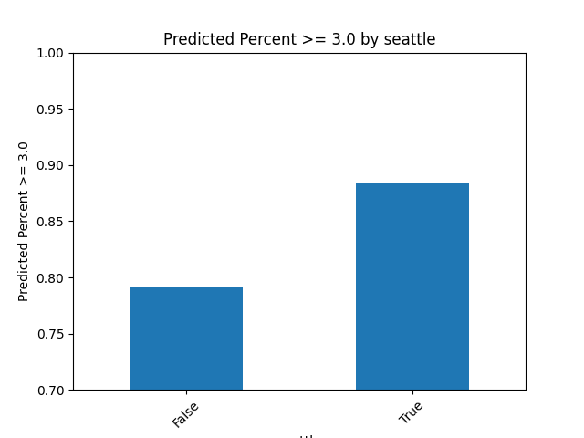
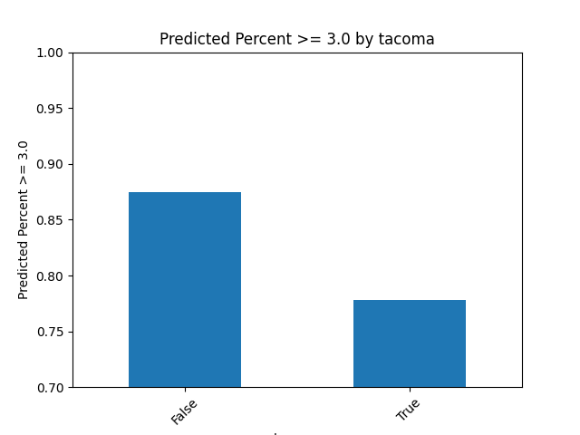

# Linear Regression Model on Categorical Data of UW Courses
## Collection, Processing, and Analysis

### Part One: Collection
```python
import json
import pickle
import sys
import requests
import http.cookiejar as cookie
from bs4 import BeautifulSoup
import re

HTML_URL_HEADER = 'https://www.washington.edu/students/'
JSON_URL_HEADER = 'https://dawgpath.uw.edu/api/v1/courses/'


# Function to retrieve course information from the UW API
def get_courses():
    # Define the campuses to fetch course data for
    campuses = {'seattle', 'tacoma', 'bothell'}
    courses = []

    # Loop through each campus
    for campus in campuses:
        # Construct the URL for the API call
        response = requests.get(f'{JSON_URL_HEADER}{campus}', cookies=cookie_jar)
        # Evaluate the text response to Python list
        courses += eval(response.text)
    return courses


# Function to build detailed course URLs from course data
def build_urls(courses):
    urls = {}

    # Loop through each course to construct its detailed URL
    for course in courses:
        key = course['key']
        url = f'{JSON_URL_HEADER}{key}'
        # Extract course prefix and number
        prefix, number = key[:-3].replace(' ', ''), key.split(' ')[-1]
        # Store the full URL with the course key
        urls[prefix + number] = url
    return urls


# Function to fetch course data in JSON format from URLs
def get_jsons(urls):
    raw_jsons = {}

    # Loop through each URL and fetch the JSON data
    for key, url in urls.items():
        response = requests.get(url, cookies=cookie_jar)
        # Parse the JSON response
        raw_jsons[key] = json.loads(response.text)
        # Log output to a file
        print(key, raw_jsons[key], file=log_file)
    return raw_jsons


# Function to scrape department information from UW course catalog pages
def build_department_urls():
    # Define the URL suffix for each campus
    campuses = {'crscatb/', 'crscat/', 'crscatt/'}
    urls = {}

    # Loop through each campus to construct department URLs
    for campus in campuses:
        url = HTML_URL_HEADER + campus
        response = requests.get(url)
        soup = BeautifulSoup(response.text, 'html.parser')
        # Loop through each link header to find department URLs
        for line in soup.findAll('li'):
            match = re.search('(?<=href=")[a-zA-Z.]+(?=">)', str(line.a))
            if match:
                department = match.group().split('.')[0].upper()
                # Store the full URL for each department
                urls[department] = url + match.group()
    return urls


def scrape_and_save_html(urls):
    html_dict = {}

    # Loop through each department URL to scrape its HTML content
    for department, dep_url in urls.items():
        response = requests.get(dep_url)
        soup = BeautifulSoup(response.text, 'html.parser')
        # Store the prettified HTML content
        html_dict[department] = soup.prettify()
    return html_dict


def process_department_html(html_dict):
    dep_word_list = {}

    # Process the HTML content to extract department words
    for department, html_content in html_dict.items():
        soup = BeautifulSoup(html_content, 'html.parser')
        # Extract and clean the department header text
        dep_string = soup.h1.text.replace('\n', '').replace('   ', '  ').split('  ')
        # Filter out unwanted words
        dep_words = [string for string in dep_string if string and string not in ('UW TACOMA', 'UW BOTHELL')]
        # Store the words for each department
        dep_word_list[department] = dep_words

    return dep_word_list


###################################################################
# COLLECT DEPARTMENT INFORMATION FROM ONLINE COURSE CATALOGUE

# # First build the department urls
# department_urls = build_department_urls()

# # Scrape the department course catalogue for department names
# html_content = scrape_and_save_html(department_urls)

# # To reduce server time scrape all html first
# # Save to file and then continue processing
# # Run once then comment out
# with open('./files/department_html_content.pkl', 'wb') as handle:
#     pickle.dump(html_content, handle, protocol=pickle.HIGHEST_PROTOCOL)

# For multiple runs just read from file
with open('./files/department_html_content.pkl', 'rb') as handle:
    html_dict = pickle.load(handle)

# Filter the department HTML to find the department keywords
processed_departments = process_department_html(html_dict)

# print(processed_departments)
with open('./files/departments.pkl', 'wb') as handle:
    pickle.dump(processed_departments, handle, protocol=pickle.HIGHEST_PROTOCOL)
with open('./files/departments.pkl', 'rb') as handle:
    html_dict = pickle.load(handle)
print(html_dict)

#################################################################
# COLLECT ALL COURSE JSONs
# TIME INTENSIVE

# Requires valid cookie file
# Instructions on how to generate your own in the '/files/cookie.txt'
# Set up cookie jar
cookie_jar = cookie.MozillaCookieJar("files/cookies.txt")
cookie_jar.load()

# Set up logging to a file
log_file = open('./files/log', 'w')
sys.stderr = log_file

# Get the courses from each campus's top level JSON
courses = get_courses()
# Build the urls for each course
urls = build_urls(courses)
# Collect the JSON for each course
courses_json = get_jsons(urls)

# Save the course JSON data
# with open('files/all_raw.json', 'w') as file:
#     json.dump(courses_json, file)

# Restore standard error and close log file
sys.stderr = sys.__stderr__
log_file.close()
##############################################################
```
### Part 2: Processing
```python
import pickle
import time

import pandas as pd
import re

from bs4 import BeautifulSoup


def remove_errors(data):
    # Remove courses from the dataset that contain a specific error pattern.
    # Searches for courses with an error message matching the pattern '.*Course.*'.
    # Uses a regular expression to identify these error messages.
    # Iterates through the dataset and deletes courses that match the criteria.
    courses_to_remove = [course for course in data if re.search('.*Course.*', str(data[course]['error']))]
    for course in courses_to_remove:
        print(f'REMOVING COURSE: {course}')
        del data[course]
    return data


def remove_options(data):
    # Remove the 'options' key from the 'prereq_graph' of each course.
    # Iterates through the dataset and checks if 'prereq_graph' exists for each course.
    # If 'prereq_graph' is present, deletes the 'options' key from it.
    for course, row in data.iterrows():
        graph = row.get('prereq_graph', {})
        if graph is not None:
            # print(f'REMOVING FOR COURSE: {course}')
            del graph['x']['options']
    return data


def get_totals(data):
    # Calculate the total count of grades and the overall GPA across all courses.
    # Iterates through each course's 'gpa_distro' and aggregates counts and GPA values.
    # The overall GPA is calculated as the weighted average of all GPAs.
    # If there are no grades (total_count is 0), the overall GPA is set to 0.
    total_count = sum(entry['count'] for course in data for entry in data[course]['gpa_distro'])
    total_gpa = sum(entry['count'] * int(entry['gpa']) for course in data for entry in data[course]['gpa_distro'])
    overall_gpa = total_gpa / total_count if total_count else 0
    return {"total_count": total_count, "overall_gpa": overall_gpa}


def get_gpa_courses(data):
    # Remove courses from the dataset based on their GPA distribution.
    # Identifies courses 'gpa_distro' is empty or has a total count of 0.
    # Iterates through the dataset and deletes such courses.
    # Also, prints the course identifier for each course removed.
    courses_to_remove = [course for course in data if not data[course]['gpa_distro'] or
                         sum(grade['count'] for grade in data[course]['gpa_distro']) == 0]
    for course in courses_to_remove:
        print(f'REMOVING COURSE: {course}')
        del data[course]
    return data


def average(data):
    # Calculate the average GPA for each course based on 'gpa_distro' and store it in 'gpa_avg'.
    # 'gpa_distro' is assumed to be a list of dictionaries with 'count' and 'gpa' keys.
    # The function computes the weighted sum of GPAs divided by the total number of counts.
    # If 'gpa_distro' is empty, the average is set to 0.
    data['gpa_avg'] = data['gpa_distro'].apply(
        lambda distro: sum(grade['count'] * int(grade['gpa']) for grade in distro) / sum(
            grade['count'] for grade in distro) if distro else 0)
    return data


def average_no_zero(data):
    # Similar to the 'average' function but excludes zero grades ('gpa' is '0').
    # Calculates the average GPA without considering zero grades and stores it in 'gpa_avg_no_drops'.
    # If 'gpa_distro' is empty or all grades are zero, the average is set to 0.
    data['gpa_avg_no_drops'] = data['gpa_distro'].apply(
        lambda distro: sum(grade['count'] * int(grade['gpa']) for grade in distro if grade['gpa'] != '0') / sum(
            grade['count'] for grade in distro if grade['gpa'] != '0') if distro else 0)
    return data


def percent_mastered(data):
    # Calculate the percentage of grades considered as 'mastered' (where 'gpa' is 30 or higher).
    # Adds a new column 'percent_mastered' to the DataFrame showing this percentage.
    # The percentage is the count of 'mastered' grades divided by the total grade count.
    # If 'gpa_distro' is empty, the percentage is set to 0.
    data['percent_mastered'] = data['gpa_distro'].apply(
        lambda distro: sum(grade['count'] for grade in distro if int(grade['gpa']) >= 30) / sum(
            grade['count'] for grade in distro) if distro else 0)
    return data


def add_level(data):
    # Extract the course level from the last three characters of 'course_id' and add to a new column.
    # Assumes that 'course_id' ends with a three-digit number representing the course level.
    # The course level is rounded down to the nearest hundred.
    data['course_level'] = data['course_id'].apply(lambda x: int(int(x[-3:]) / 100) * 100)
    return data


def flatten_coi_data(data):
    # Extract and flatten 'coi_data' from each row into separate columns.
    # Initializes lists to store data for new columns: 'course_coi', 'course_level_coi', 'curric_coi',
    # 'percent_in_range'.
    # Iterates through the DataFrame, extracting data from 'coi_data' and appending it to the respective lists.
    # Appends None if 'coi_data' is missing or the key does not exist in 'coi_data'.
    # The new columns are added to the DataFrame with the extracted data.
    course_coi, course_level_coi, curric_coi, percent_in_range = [], [], [], []
    for index, row in data.iterrows():
        coi_data = row.get('coi_data', {})
        course_coi.append(coi_data.get('course_coi'))
        course_level_coi.append(coi_data.get('course_level_coi'))
        curric_coi.append(coi_data.get('curric_coi'))
        percent_in_range.append(coi_data.get('percent_in_range'))
    data['course_coi'], data['course_level_coi'], data['curric_coi'], data[
        'percent_in_range'] = course_coi, course_level_coi, curric_coi, percent_in_range
    return data


def flatten_concurrent_courses(data):
    # Process 'concurrent_courses' data for each row, creating a set of course keys with spaces removed.
    # Adds a new column 'concurrent_courses' to the DataFrame with the processed data.
    # If 'concurrent_courses' is missing or empty, None is appended to the list.
    courses = []
    for index, row in data.iterrows():
        concurrent_courses = row.get('concurrent_courses')
        if concurrent_courses:
            fixed_set = {key.replace(' ', '') for key in concurrent_courses.keys()}
            courses.append(fixed_set)
        else:
            courses.append(None)
    data['concurrent_courses'] = courses
    return data


def flatten_prereq(data):
    # Process prerequisite data ('prereq_graph') for each row and add two new columns: 'has_prereq' and 'is_prereq'.
    # 'has_prereq' lists courses that are prerequisites for the current course.
    # 'is_prereq' lists courses for which the current course is a prerequisite.
    # Excludes the current course ('course_id') from both lists.
    # Adds None to the lists if 'prereq_graph' is missing or does not contain the required keys.
    has_prereq_of, is_prereq_for = [], []
    for index, row in data.iterrows():
        prereq_graph = row.get('prereq_graph')
        self_course_id = row.get('course_id')
        has_set = {course.replace(' ', '') for course in
                   prereq_graph.get('x', {}).get('edges', {}).get('from', {}).values() if
                   course != self_course_id} if prereq_graph else {None}
        is_set = {course.replace(' ', '') for course in
                  prereq_graph.get('x', {}).get('edges', {}).get('to', {}).values() if
                  course != self_course_id} if prereq_graph else {None}
        has_prereq_of.append(has_set)
        is_prereq_for.append(is_set)
    data['has_prereq'], data['is_prereq'] = has_prereq_of, is_prereq_for
    return data


def flatten_course_offered(data):
    # Process 'course_offered' data for each row, extracting the quarters in which the course is offered.
    # Adds a new column 'course_offered' to the DataFrame with a set of quarters for each course.
    # Handles special cases like 'jointly' offered courses and splits on ';'.
    # Adds None if 'course_offered' is missing or no specific quarter information is found.
    offered, quarter_mapping = [], {'A': 'autumn', 'W': 'winter', 'Sp': 'spring', 'S': 'summer'}
    for index in data.index:
        line = data.loc[index]['course_offered']
        quarter_set = set()
        if line:
            if 'jointly' in line:
                line = line.split(';')[1].strip() if ';' in line else ''
            for abbrev in quarter_mapping:
                if abbrev in line:
                    quarter_set.add(quarter_mapping[abbrev])
            if not line:
                quarter_set.add(None)
        else:
            quarter_set.add(None)
        offered.append(quarter_set)
    data['course_offered'] = offered
    return data


def flatten_description(data):
    # Process 'course_description' for each row, removing prepositions, short words, and numeric words.
    # Adds a new column 'course_description' to the DataFrame with the cleaned description.
    # Splits the description into words and filters them based on specified criteria.
    # Adds a set of None if 'course_description' is missing or no words meet the criteria.
    prepositions = {'aboard', 'about', 'above', 'across', 'after', 'against', 'along', 'among', 'around', 'before',
                    'behind', 'below', 'beneath', 'beside', 'between', 'beyond', 'concerning', 'considering', 'despite',
                    'during', 'except', 'inside', 'outside', 'regarding', 'round', 'since', 'through', 'toward',
                    'under', 'underneath', 'until', 'within', 'without'}
    for course in data.index:
        course_description = data.loc[course, 'course_description']
        if course_description:
            words = (course_description.replace(',', '').replace('.', '').replace(';', '').replace(':', '').
                     replace('/', ' ').replace(')', '').replace('(', '').split())
            string_set = {word for word in words if
                          word.lower() not in prepositions and len(word) > 4 and not word.isdigit()}
        else:
            string_set = {None}
        data.at[course, 'course_description'] = string_set
    return data


def add_departments(data):
    # Add a new column 'departments' to the DataFrame, mapping each course to its department(s).
    # Uses a pre-loaded department dictionary to find department names for each course.
    # Handles cases where the department abbreviation is not found in the dictionary.
    with open('./files/departments.pkl', 'rb') as handle:
        dep_dict = pickle.load(handle)
    dep_list = []
    for course in data.index:
        key = str(data.loc[course, 'department_abbrev']).replace(' ', '')
        print(dep_dict.get(key, {None}))
        dep_list.append(set(dep_dict.get(key, {None})))
    data['departments'] = dep_list
    return data


def remove_extra_columns(data):
    # Remove specific columns from the DataFrame that are no longer needed.
    # Targets columns: 'coi_data', 'gpa_distro', 'prereq_graph', 'prereq_string'.
    # Checks if each column exists before attempting to delete it.
    for column in ['coi_data', 'gpa_distro', 'prereq_graph', 'prereq_string']:
        if column in data.columns:
            del data[column]
    return data


# Initialize a dictionary to store execution times and number of entries
timings = {}
entries = {}

#######################################################################################
# # TIME FOR COMPLETION ~8 MIN
#
# data = pd.read_json('./files/all_raw.json')  # FILE_SIZE: 27.58 MB
# entries['initial'] = data.columns.size
# print(data)
#
# # Timing remove_errors function
# start_time = time.time()
# data = remove_errors(data)
# entries['Remove Errors'] = data.columns.size
# timings['Remove Errors'] = time.time() - start_time
# data = data.drop('error', inplace=False)
# print(data)
#
# # Timing get_gpa_courses function
# start_time = time.time()
# data = get_gpa_courses(data)
# entries['Get GPA Courses'] = data.columns.size
# timings['Get GPA Courses'] = time.time() - start_time
#
# print(data)
# for entry in entries:
#     print(f'{entry}: {entries[entry]}')
# for entry in timings:
#     print(f'{entry}: {timings[entry]}')
#
# data.to_pickle('./files/no_gpa_dataframe.pkl')  # FILE_SIZE: 18.62 MB
# # size:
# # initial: 10826
# # Remove Errors: 10817
# # Get GPA Courses: 6717
# # time:
# # Remove Errors: 5.317916393280029
# # Get GPA Courses: 488.68519949913025

######################################################################################


# read from disk and transpose data
data = pd.read_pickle('./files/no_gpa_dataframe.pkl').T

# # Timing get_totals function
# start_time = time.time()
# totals = get_totals(data)
# timings['Get Totals'] = time.time() - start_time
#
# print(totals)


# Timing subsequent operations
functions_to_time = [
    ('Remove Options', remove_options),
    ('Add Departments', add_departments),
    ('Average', average),
    ('Average No Zero', average_no_zero),
    ('Percent Mastered', percent_mastered),
    ('Flatten COI Data', flatten_coi_data),
    ('Flatten Concurrent Courses', flatten_concurrent_courses),
    ('Flatten Prerequisites', flatten_prereq),
    ('Add Level', add_level),
    ('Flatten Course Offered', flatten_course_offered),
    ('Flatten Description', flatten_description),
    ('Remove Extra Columns', remove_extra_columns)
]

for func_name, func in functions_to_time:
    start_time = time.time()
    data = func(data)
    timings[func_name] = time.time() - start_time
    print(data)
    print(data.loc['TMATH208'])

# Timing the final save to disk operation
start_time = time.time()
data.to_pickle('./files/clean_dataframe.pkl')
timings['Final Save to Disk'] = time.time() - start_time

print(data)
print('FINAL COURSE EXAMPLE: ')
print(data.loc['TMATH208'])

# Display timings
for operation, time_taken in timings.items():
    print(f"{operation}: {time_taken:.2f} seconds")

# Average: 0.07 seconds
# Average No Zero: 0.09 seconds
# Percent Mastered: 0.06 seconds
# Flatten COI Data: 0.22 seconds
# Flatten Concurrent Courses: 0.22 seconds
# Flatten Prerequisites: 0.25 seconds
# Add Level: 0.01 seconds
# Flatten Course Offered: 0.35 seconds
# Flatten Description: 0.31 seconds
# Remove Extra Columns: 0.00 seconds
# Final Save to Disk: 0.04 seconds
```
### Part 3: Analysis
```python
import pandas as pd
from sklearn.model_selection import train_test_split
from sklearn.preprocessing import StandardScaler
from sklearn.linear_model import LinearRegression
from sklearn.pipeline import make_pipeline
from sklearn.metrics import mean_squared_error, mean_absolute_error, r2_score
import math
import matplotlib.pyplot as plt

# Load the data
df = pd.read_pickle('./files/clean_dataframe.pkl')

# Fill NaN values with the mean of each column
df['course_coi'].fillna(df['course_coi'].mean(), inplace=True)
df['course_level_coi'].fillna(df['course_level_coi'].mean(), inplace=True)
df['curric_coi'].fillna(df['curric_coi'].mean(), inplace=True)
df['percent_in_range'].fillna(df['percent_in_range'].mean(), inplace=True)

# Extract and convert 'course_credits' to float
df['course_credits'] = df['course_credits'].str.extract('(\d+\.?\d*)').astype(float)

# One-hot encode 'course_campus' and drop one category to avoid multicollinearity
campus_dummies = pd.get_dummies(df['course_campus'], drop_first=True)

# Combine all features for the model
x = pd.concat([df[['is_bottleneck', 'is_gateway', 'course_level', 'course_coi', 'course_level_coi', 'curric_coi',
                   'percent_in_range', 'course_credits']], campus_dummies], axis=1)
x = x.astype({'is_bottleneck': bool, 'is_gateway': bool, 'course_level': int, 'course_credits': int})

# Prepare target variable y by scaling the GPA
y = df['percent_mastered']  # / 100

# Split the data into training and testing sets
x_train, x_test, y_train, y_test = train_test_split(x, y, test_size=0.25, random_state=0)

# Create a pipeline for scaling and linear regression
pipeline = make_pipeline(StandardScaler(), LinearRegression())
pipeline.fit(x_train, y_train)

# Predict using the model
y_pred = pipeline.predict(x_test)

# Evaluate the model's performance
mse = mean_squared_error(y_test, y_pred)
rmse = math.sqrt(mse)
mae = mean_absolute_error(y_test, y_pred)
r2 = r2_score(y_test, y_pred)

# Print out the evaluation metrics
print(f"Mean Squared Error (MSE): {mse:.2f}")
print(f"Root Mean Squared Error (RMSE): {rmse:.2f}")
print(f"Mean Absolute Error (MAE): {mae:.2f}")
print(f"Coefficient of Determination (R² score): {r2:.2f}")

# Extract model coefficients
model = pipeline.named_steps['linearregression']
coefficients = model.coef_
features = x.columns

# Print out the coefficients with their meanings
print("\nModel Coefficients and their Impact on Predicted GPA (as Percentage):")
for feature, coef in zip(features, coefficients):
    if feature == 'is_bottleneck':
        print(
            f"{feature}: {coef:.4f} - Being a bottleneck course (if True) is associated with a {coef:.2f}% change in "  
         + "competency.")
    elif feature == 'is_gateway':
        print(
            f"{feature}: {coef:.4f} - Being a gateway course (if True) is associated with a {coef:.2f}% change in "
            + "competency.")
    elif feature not in ['course_coi', 'course_level_coi', 'curric_coi', 'percent_in_range']:
        print(
            f"{feature}: {coef:.4f} - A unit increase in '{feature}' is associated with a {coef:.2f}% change in "
            + "competency.")

# Combine test set and predictions for plotting
predicted_gpa = pd.DataFrame({'Actual': y_test, 'Predicted': y_pred})
predicted_gpa = pd.concat([x_test.reset_index(drop=True), predicted_gpa.reset_index(drop=True)], axis=1)

# Plotting
for feature in ['tacoma', 'seattle', 'is_bottleneck', 'is_gateway', 'course_level', 'course_credits']:
    feature_avg = predicted_gpa.groupby(feature).mean()
    plt.figure()
    feature_avg['Predicted'].plot(kind='bar')
    plt.ylabel('Predicted Percent >= 3.0')
    plt.title(f'Predicted Percent >= 3.0 by {feature}')
    plt.xticks(rotation=45)
    plt.ylim(0.7, 1.0)
    plt.show()

```
### Results:
```
GOOD MODEL

Mean Squared Error (MSE): 0.01
Root Mean Squared Error (RMSE): 0.11
Mean Absolute Error (MAE): 0.09
Coefficient of Determination (R² score): 0.22

ONLY EXPLAINING A CHANGE OF 22%
MAKES SENSE THE CATAGORIES REALLY SHOULD HAVE TO MUCH IMPACT


Model Coefficients and their Impact on Predicted GPA (as Percentage):
is_bottleneck: 0.0007 - Being a bottleneck course (if True) is associated with a 0.00% change in competency.
is_gateway: -0.0112 - Being a gateway course (if True) is associated with a -0.01% change in competency.
course_level: 0.0189 - A unit increase in 'course_level' is associated with a 0.02% change in competency.
course_credits: -0.0181 - A unit increase in 'course_credits' is associated with a -0.02% change in competency.
seattle: 0.0280 - A unit increase in 'seattle' is associated with a 0.03% change in competency.
tacoma: -0.0125 - A unit increase in 'tacoma' is associated with a -0.01% change in competency.
```






